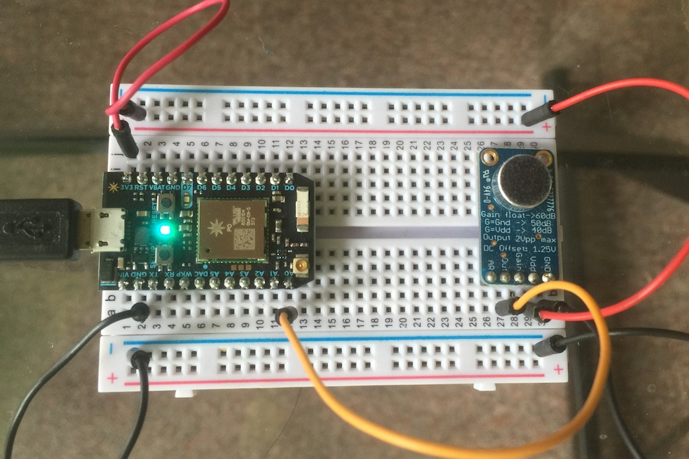

# Photon Audio Sample 1
*Sample program for streaming audio from a Particle Photon to a node.js server over TCP*



**Note: There is new location for audio samples: [https://github.com/rickkas7/photonAudio] (https://github.com/rickkas7/photonAudio) that contains this sample and will contain others. You should go there, instead, for updates.**

This simple project uses an [Adafruit 1713] (https://www.adafruit.com/products/1713) Electret Microphone Amplifier - MAX9814 with Auto Gain Control to capture audio on the Photon, then sends the data via TCP to a server.

I used a local server running node.js to receive and process the files in this case, but the data rate is only 16K bytes/second so it should work over the Internet, as well.

## Photon Side

The connections from the microphone board are:

* AR   - No connection
* Out  - Audio out (analog) to Photon A0
* Gain - No connection
* VDD  - 3V3
* GND  - GND

Then you just need to flash the [audio1.cpp] (https://github.com/rickkas7/photonAudioSample1/blob/master/audio1.cpp) file to your Photon. Make sure you edit the IP address of your server! 

The code also requires the [SparkIntervalTimer] (https://github.com/pkourany/SparkIntervalTimer) library, so make sure you add that in Particle Build (Web IDE) or do whatever is necessary for the build environment you are using.

The code has many comments and should be self-explanatory.


## Server Side

The server-side code is written in [node.js] (https://nodejs.org). You'll want to copy the [audioserver.js] (https://github.com/rickkas7/photonAudioSample1/blob/master/audioserver.js) file to your computer. 

It requires the standard Node 4.5.0 features plus the [wav package] (https://github.com/TooTallNate/node-wav) to output the audio files. You install it using:

```
npm install wav
```

Then you run the server:

```
node audioserver.js
```

A directory called out will be created in the same directory and will contain audio files like 00001.wav, 00002.wav, etc.. You should be able to play these on your computer.


## Using It

With the code loaded on the Photon and the server running, hit the SETUP button to being recording. The blue D7 LED turns on after a connection is made to the server. Recording stops when you hit the SETUP button again, or the maximum recording time is reached. That's currently 30 seconds, but there's really nothing on either side that requires that limit. It could be hours if you wanted it to be.

